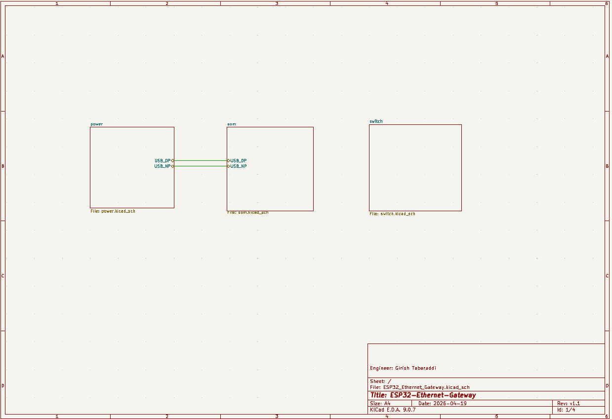
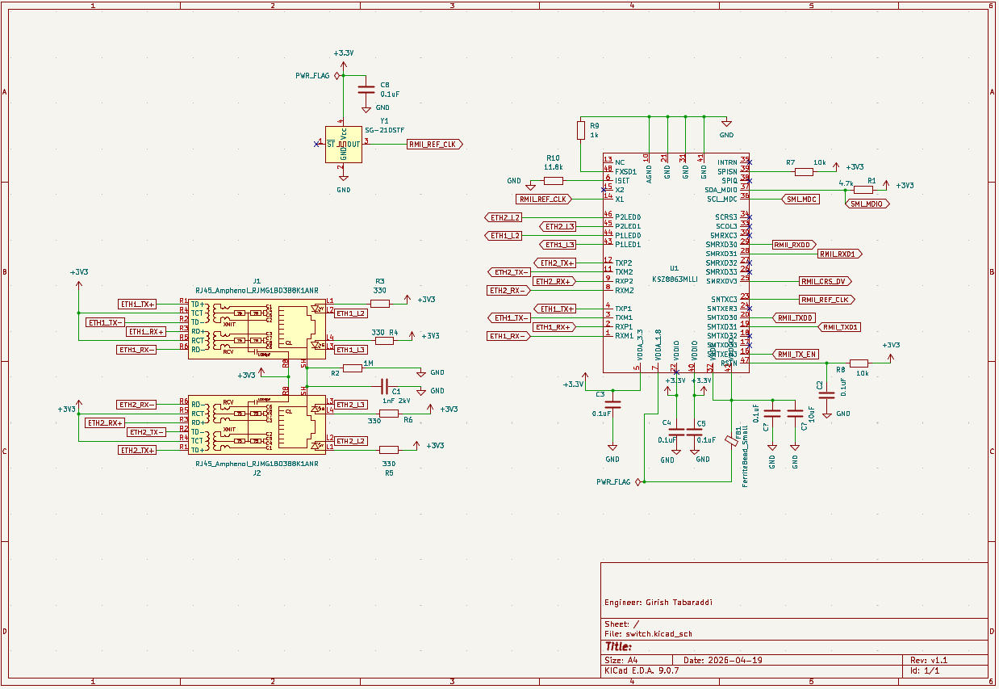
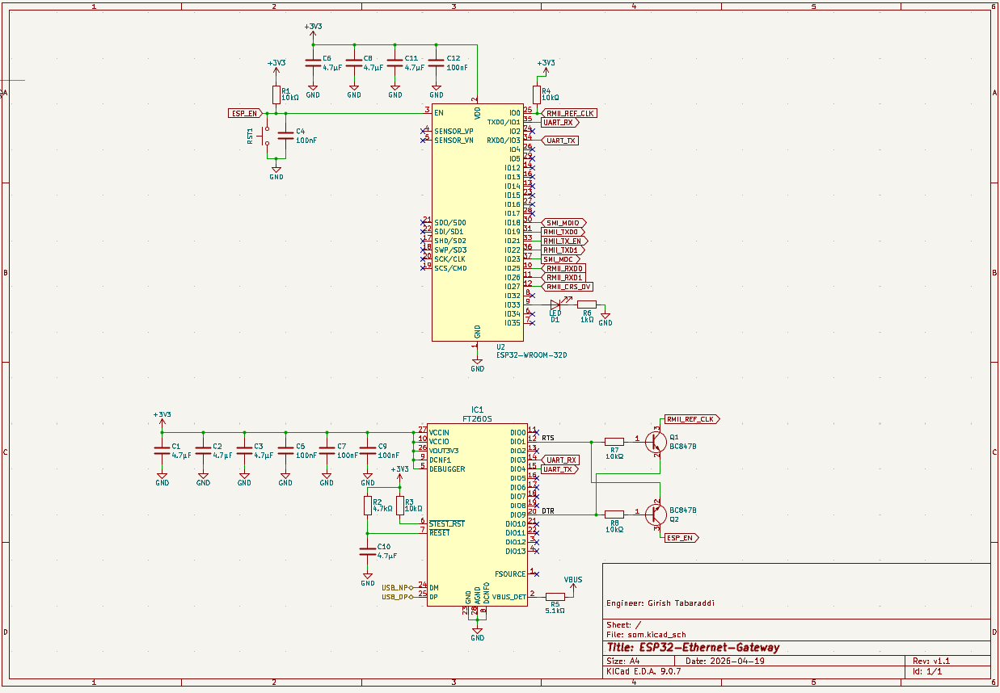
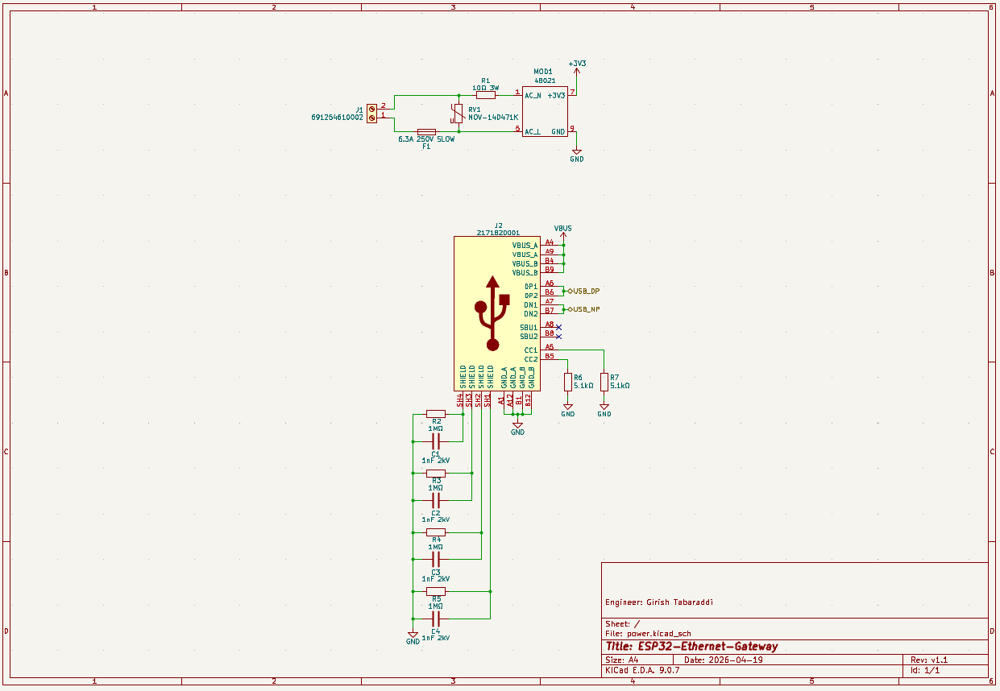

# 🌐 ESP32 Ethernet & USB-C Gateway

[](https://www.kicad.org/)
[](https://www.espressif.com/)
[](https://opensource.org/licenses/MIT)

> A professionally structured, production-ready KiCad schematic integrating an ESP32-WROOM-32D with wired dual-port Ethernet, high-speed USB-C debugging, and an onboard AC/DC power supply.

---

## 📖 Project Overview

This project was developed as an advanced hardware engineering challenge. The primary objective was to design a robust, hierarchical schematic bridging a standard ESP32 wireless microcontroller with a highly reliable wired Ethernet network, utilizing modern component sourcing (Mouser & JLCPCB) and strict IPC footprint standards.

### ✨ Key Features
* **Dual-Port Wired Ethernet:** Powered by a Microchip 3-port switch.
* **Modern Interface:** 16-pin USB-C 2.0 with proper Configuration Channel (CC) termination.
* **Plug-and-Play Flashing:** Custom cross-coupled transistor logic for automatic ESP32 bootloader entry.
* **Mains-Ready Power:** Onboard 230V AC to 3.3V DC conversion.
* **Factory Ready:** Fully optimized Bill of Materials (BOM) with LCSC/JLCPCB part numbers for automated SMT assembly.

---

## 🏗️ Hardware Architecture & System BOM

The core logic is distributed across a hierarchical sheet structure to ensure signal integrity and readability.

| Reference | Component | Function | Sourcing / Assembly |
| :---: | :--- | :--- | :--- |
| **U2** | `ESP32-WROOM-32D` | Main MCU (Wi-Fi/BT + RMII MAC) | JLCPCB SMT (`C473012`) |
| **U4** | `KSZ8863MLLI` | 3-Port 10/100 Ethernet Switch | Mouser (`998-KSZ8863MLLI`) |
| **U1** | `FT260S-U` | HID-Class USB to UART Bridge | Mouser (`895-FT260S-U`) |
| **MOD1** | `Myrra 48021` | 230V AC to 3.3V DC Power Supply | Mouser (`872-48021`) |
| **J2** | `Molex 2171820001` | USB 2.0 Type-C Receptacle | Mouser (`538-217182-0001`) |
| **Y2** | `Epson SG-210STF` | 50.000MHz Active Oscillator | Mouser (`732-SG-210STF50ML5`) |

---

## 📐 Schematic & Design Highlights

### 1. Hierarchical Top-Level Design
To maintain a clean schematic, the design is split into distinct functional blocks using Global Labels and Sub-sheets.
> 📸 ****

### 2. High-Speed Ethernet (RMII) & Clocking
The ESP32 communicates with the `KSZ8863` switch via the **RMII (Reduced Media Independent Interface)**. 
* A dedicated **50MHz Epson Active Oscillator** acts as the heartbeat for the entire network, feeding both the ESP32 (`IO0`) and the Ethernet Switch simultaneously to prevent clock-skew synchronization issues.
* External dual RJ45 MagJacks (`Amphenol RJMG1BD3B8K1ANR`) handle the magnetic isolation.
> 📸 ****

### 3. Modern USB-C & FTDI Debugging
The traditional CH340 was replaced with a premium **FTDI FT260S** for superior driverless HID-class operation. 
* **USB-C Implementation:** Dual `5.1kΩ` pull-down resistors on the `CC1` and `CC2` lines ensure compliance, allowing standard USB-C to USB-C cables to supply power.
* **Auto-Reset Circuitry:** Utilizes a classic cross-coupled dual NPN Transistor (`BC817`) setup tied to the FTDI's `RTS` and `DTR` lines. This acts as a hardware safety gate to prevent the ESP32 from locking up, while allowing seamless one-click firmware flashing.
> 📸 ****

---

## 🔌 Power Delivery Tree

The board is completely self-contained and does not require an external DC brick.
1. **230V AC Mains** enters via a Würth Elektronik terminal block.
2. Protection logic flows through a `6.3A Slow Blow Fuse`, a `Bourns MOV`, and a `10Ω 3W` surge resistor.
3. The **Myrra 48021 Module** steps the AC directly down to a stable **3.3V DC** at up to 900mA.
4. Clean 3.3V logic is distributed locally with `10uF` and `0.1uF` decoupling capacitors placed optimally near all ICs.
> 📸 ****
---

## 🛠️ How to Open This Project

1. Install [KiCad 9.0.7](https://www.kicad.org/) (or newer).
2. Clone this repository:
   ```bash
   git clone [https://github.com/GirishTabaraddi/ESP32-Ethernet-Gateway-KiCAD.git](https://github.com/GirishTabaraddi/ESP32-Ethernet-Gateway-KiCAD.git)